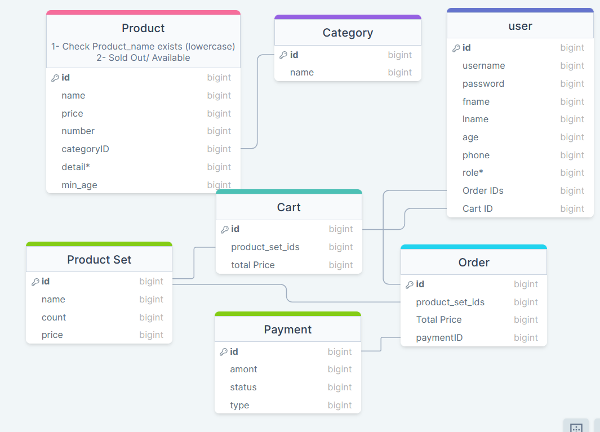

# CLI-Ecommerce-Engine

A command-line online shopping application written in Python. Browse products, manage a cart, place orders, and administer the store—all from the terminal.

> **Note:** This is not the final version of the project. The repository is public for testing and feedback. If you try it out and find bugs, please [open an issue](https://github.com/Parsalimi/CLI-Ecommerce-Engine/issues)—thank you for your support!

## Features

### For customers
- **Sign up & sign in** with username/password (session persists between runs)
- **Shop** with free-text search or advanced filters (name, category, price, stock)
- **Cart** — view, edit quantities, remove items, and checkout
- **Order history** with payment details
- **Age restrictions** — items with a minimum age are hidden or blocked for younger users

### For admins (`role = 1`)
- **Items** — add, edit, soft-delete, search, and sort catalog entries
- **Categories** — create and manage product categories
- **Users** — view, search, edit, and remove accounts
- **User orders** — inspect any customer's order history

### Technical highlights
- Object-oriented design with separate modules for users, items, carts, orders, payments, and categories
- File-based persistence under `DB/` (plain-text records)
- Colored terminal output via [colorama](https://pypi.org/project/colorama/)
- Tabular display via [prettytable](https://pypi.org/project/prettytable/)

## Requirements

- **Python 3.8+**
- **Windows** (the app uses `cls` and Windows-style paths; other platforms may need minor adjustments)
- Python packages:

```bash
pip install colorama prettytable
```

## Database Design (ER Diagram)

The system uses a relational-style structure implemented using file-based persistence. Below is the Entity Relationship Diagram showing the core relationships between users, products, carts, orders, and categories.



## Getting started

1. **Clone the repository**

```bash
git clone https://github.com/Parsalimi/CLI-Ecommerce-Engine.git
cd CLI-Ecommerce-Engine
```

2. **Install dependencies**

```bash
pip install colorama prettytable
```

3. **Create the login session file** (required on first run)

```bash
echo. > DB\user_db\the_latest_login_id.txt
```

4. **Run the application**

```bash
python main.py
```

## Usage

Commands are typed at the `>` prompt. Input is case-insensitive unless noted otherwise.

### Main menu (not logged in)

| Command   | Action        |
|-----------|---------------|
| `sign up` | Create account |
| `sign in` | Log in        |

### Main menu (logged in — customer)

| Command    | Action                          |
|------------|---------------------------------|
| `shop`     | Browse and add items to cart    |
| `cart`     | Manage cart and checkout        |
| `order`    | View your order history         |
| `sign out` | Log out                         |

### Main menu (logged in — admin)

All customer commands, plus:

| Command     | Action                    |
|-------------|---------------------------|
| `item`      | Item management           |
| `category`  | Category management       |
| `user`      | User management           |
| `userorder` | View orders by user ID    |

### Shopping

Inside the shop menu:

- Type **`filter`** for advanced search (name, category, price range, stock, sorting)
- Type any **search term** to find items by name or category
- Type **`exit`** to return to the main menu

### Cart

Inside the cart menu:

| Command    | Action                              |
|------------|-------------------------------------|
| `show`     | Display cart contents and total     |
| `edit`     | Change item quantity                |
| `remove`   | Remove an item                      |
| `checkout` | Confirm purchase (`y` to proceed)   |
| `exit`     | Return to main menu                 |

## Demo data

The repo ships with sample users, categories, and products in `DB/`. You can sign in with an existing account or create your own via **sign up**.

Example admin account (included in sample data):

| Username | Password | Role  |
|----------|----------|-------|
| `parsa`  | `1234`   | Admin |

> Passwords are stored in plain text for this demo project only. Do not use real credentials.

## Project structure

```
CLI-Ecommerce-Engine/
├── main.py          # Entry point & main menu
├── user.py          # Authentication & user management
├── item.py          # Product catalog
├── category.py      # Product categories
├── cart.py          # Shopping cart & checkout
├── order.py         # Order history
├── payment.py       # Payment records
├── productset.py    # Line items in carts/orders
├── tools.py         # Terminal helpers & input validation
├── DB/              # File-based data store
│   ├── user_db/
│   ├── item_db/
│   ├── category_db/
│   ├── cart_db/
│   ├── order_db/
│   ├── payment_db/
│   └── product_set_db/
└── archive/         # Early prototypes & notes
```

## Data storage

Each entity is stored as one line per record in a `.txt` file under `DB/`. Records are Python dictionary literals (e.g. `{'user_id': 1, 'username': '...', ...}`). ID counters and the last logged-in user are tracked in separate small text files in the same folders.

## License

This project is licensed under the [MIT License](LICENSE.md).

## Author

**Parsa Salimi** — [github.com/Parsalimi](https://github.com/Parsalimi)
